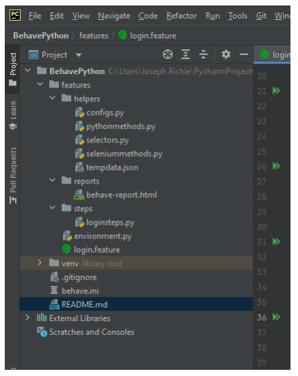

# BehavePython

This repo has the code which implements a Selenium Test framework using BDD (Behave) for the website, https://www.saucedemo.com/

###**Create a new project in PyCharm**

- Install behave -- pip install behave

- Install behave HTML reporter -- pip install behave-html-pretty-formatter

- Install the Chrome Webdriver auto installer -- pip install chromedriver-autoinstaller

- Create a new folder called, features. This will contain all the project folders.

- Create a new sub folder called helpers, features/helpers. In this folder create the following
files pythonmethods.py, selectors.py, configs.py, seleniummethods.py and tempdata.json.
This is our implementation of the POM.

- Create a new sub folder called reports, features/reports. The generated HTML reports will be
placed here.

- Create a new file, login.feature inside the features folder and write the BDD steps to this file.

- Create a new file, loginsteps.py inside the features/steps folder and write the Step definitions
in this file.

- Create a new file, environment.py inside the features folder. This will contain all our Driver
information along with Before and After methods.

- Create a new file, behave.ini in the root (outside the features folder). This will contain all our
reporting setup.

- Follow the steps here to setup reporting: https://pypi.org/project/behave-html-prettyformatter/

###**Running commands:**
- behave --no-capture => Executes all the feature files and prints any print statement to the
terminal

- behave .\features\login.feature --no-capture => Executes the login.feature file and prints
any print statement to the terminal.

- behave -n 'Test4' --no-capture => Executes any scenario whose name contains ‘Test4’.

- behave --no-capture -f html-pretty -o features/reports/behave-report.html => Executes all
the feature files and stores the report in the reports folder.

- behave --no-capture --tags=temp => Executes only the scenarios with the tag ‘temp’

###**Minimum ensured things:**
- Steps are sharable between Feature files seamlessly.

- DataTable support is present.

- Writing and Reading from a temporary file for passing data between steps, reducing the
need of using global variables for the same.

- Before and After Hooks, for setting up the Driver and then cleaning up any created data.

- A reporting feature to create sharable HTML reports.

###**Links:**
- GitHub repo: https://github.com/JosefRichie13/BehavePython

- Behave docs: https://behave.readthedocs.io/en/latest/

- Alternate HTML Reporter: https://pypi.org/project/behave-html-formatter/

- Chrome Webdriver Auto installer: https://pypi.org/project/chromedriver-autoinstaller/

- Edge Webdriver Auto installer: https://pypi.org/project/edgedriver-autoinstaller/

###**Folder Structure**
